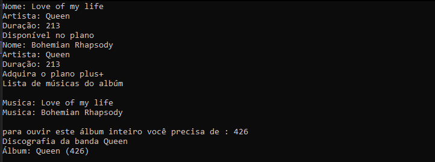

<h1>Sound Screen </h1>

<h2>Bem vindo(ao) meu repositório</h2>

>Status do projeto: Em Desenvolvimento

## Descrição do projeto
 

Este projeto tem como objetivo criar um sistema de registro e avalições de bandas.

    
## Funcionalidades

:heavy_check_mark: `Funcionalidade 1:` Registrar uma banda

:heavy_check_mark: `Funcionalidade 2:` Visualizar bandas registradas

:heavy_check_mark: `Funcionalidade 3:` Avaliar as bandas registradas

:heavy_check_mark: `Funcionalidade 4:` Visualizar a média das bandas registradas
        
<video width="420" height="340" controls="controls">
    <source src="./filme.mp4" type="video/mp4">
</video>
 

    <h1>Aplicação<h1>
    

            
## Ferramentas utilizadas

   
### Você também me encontra em:
&nbsp;&nbsp;
&nbsp;&nbsp;
 
<h2>Guia</h2>

coloque seu nome no campo de nome de usuario
e a senha digite a seguinte: alohomora
